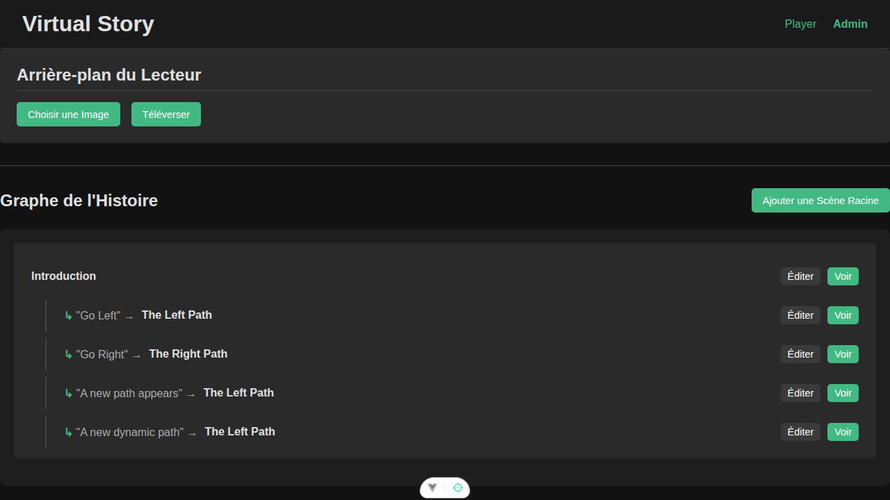

# Virtual Story

Virtual Story is an interactive, "choose your own adventure" video application. It allows users to navigate through a branching narrative by making choices at the end of video segments, creating a personalized story experience. This project is inspired by platforms like LifeSelector.

## Technology Stack

- **Frontend:** Vue.js
- **Backend:** Node.js with Express.js
- **Database:** MariaDB

## How It Works

A story is constructed from multiple short video segments. At the end of each segment, the viewer is presented with choices that lead to different video segments, allowing the story to branch. The narrative is managed by a decision tree stored in the database.

## Installation

Follow these steps to set up the project for development.

### 1. Prerequisites

Ensure you have the following software installed on your system:

-   **Node.js:** (v18 or later recommended)
-   **npm:** (comes with Node.js)
-   **MariaDB:** A running instance of the MariaDB server.
-   **ffmpeg:** This is required for video processing tasks in the administration panel (e.g., generating thumbnails). You can install it using your system's package manager (e.g., `apt`, `brew`, `choco`).

### 2. Clone the Repository

```bash
git clone <repository-url>
cd virtual-story
```

### 3. Database Setup

You need to create a dedicated database and user for the application.

1.  Log in to your MariaDB server as a user with sufficient privileges (e.g., `root`):
    ```bash
    mysql -u root -p
    ```

2.  Run the following SQL commands to create the database and a new user. Replace `'your_db_user'` and `'your_db_password'` with secure credentials.

    ```sql
    CREATE DATABASE virtualstory;
    CREATE USER 'your_db_user'@'localhost' IDENTIFIED BY 'your_db_password';
    GRANT ALL PRIVILEGES ON virtualstory.* TO 'your_db_user'@'localhost';
    FLUSH PRIVILEGES;
    EXIT;
    ```

### 4. Backend Setup

1.  Navigate to the backend directory:
    ```bash
    cd backend
    ```

2.  Copy the example environment file:
    ```bash
    cp .env.example .env
    ```

3.  Edit the new `.env` file and replace the placeholder values with the database credentials you just created.

4.  Install the dependencies:
    ```bash
    npm install
    ```

### 5. Frontend Setup

1.  Navigate to the frontend directory from the project root:
    ```bash
    cd frontend
    ```

2.  Install the dependencies:
    ```bash
    npm install
    ```

## How to Run

1.  **Initialize the Database Schema:**
    Before starting the server for the first time, you must create the necessary tables. From the project's **root directory**, run:
    ```bash
    node backend/init-db.js
    ```

2.  **Start the Backend Server:**
    From the **root directory**, run:
    ```bash
    node backend/server.js
    ```
    The server will start on `http://localhost:3000`.

3.  **Start the Frontend Development Server:**
    In a new terminal, navigate to the **frontend directory** and run:
    ```bash
    npm run dev
    ```
    The application will be accessible at `http://localhost:5173` (or the next available port).

## Tutoriel d'Utilisation

L'interface d'administration vous permet de construire et de visualiser votre histoire interactive.

### Vue Principale : Graphe de l'Histoire

La page principale de l'administration affiche le "Graphe de l'Histoire", une vue hiérarchique qui vous montre les connexions entre toutes vos scènes.

-   **Scènes Racines :** Les scènes sans parent sont affichées au niveau supérieur.
-   **Scènes Enfants :** Les scènes liées par un choix sont imbriquées sous leur scène parente.

Chaque scène dans le graphe dispose de boutons pour **"Éditer"** (modifier ses détails et ses liens) ou **"Voir"** (la prévisualiser dans le lecteur).



### Gérer les Scènes

1.  **Ajouter une Scène Racine :** Utilisez le bouton **"Ajouter une Scène Racine"** pour créer une nouvelle scène qui sera un point de départ pour une branche de votre histoire.
2.  **Création en série :** Lors de la création d'une scène, vous restez sur la page de formulaire après validation. Cela permet de créer rapidement de nombreuses scènes à la suite sans revenir à la liste.
3.  **Éditer une Scène :** Sur la page d'édition, vous pouvez :
    -   Modifier le titre de la scène et l'associer à un **Chapitre**.
    -   Téléverser une nouvelle vidéo et sa miniature.
    -   **Ajouter un choix (enfant) :** Liez cette scène à une autre en créant un choix.
    -   **Lier un parent :** Créez un lien *entrant* depuis une autre scène, la transformant en enfant de cette dernière.

### Gestion des Parties (Chapitres)

Le système de "Parties" permet d'organiser votre narration en chapitres distincts.

-   **Création :** Donnez un titre à votre chapitre et sélectionnez sa scène de départ.
-   **Édition :** Vous pouvez renommer un chapitre ou modifier sa scène de départ à tout moment.
-   **Vidéo d'Ambiance (Loop) :** Vous pouvez téléverser une "vidéo boucle" par chapitre. Cette vidéo sera affichée en arrière-plan dans le lecteur (panneau de gauche) pour renforcer l'immersion.
-   **Navigation :** Les chapitres apparaissent dans l'en-tête de l'application pour un accès rapide.

### Synchronisation de la Base de Données

Si vous rencontrez des erreurs de type "Unknown column" ou si vous venez de mettre à jour l'application, utilisez le bouton **"Synchroniser la Base de Données"** dans l'onglet Administration. Cet outil mettra à jour votre schéma SQL automatiquement.

### Expérience de Lecture

Le lecteur a été optimisé pour une immersion totale :
-   **Pleine Page :** Les vidéos s'affichent automatiquement en mode "pleine page" (overlay CSS) pour masquer l'interface pendant la lecture.
-   **Autoplay Intelligent :** L'application tente de lancer la vidéo avec le son, et bascule en mode muet si le navigateur bloque la lecture automatique.
-   **Navigation Narrative :** Le bouton "Scènes Précédentes" permet de revenir en arrière dans l'histoire, et non simplement dans l'historique du navigateur.

### Personnaliser l'Arrière-plan

Dans la section **"Arrière-plan du Lecteur"**, vous pouvez téléverser une image de fond globale qui sera affichée derrière l'interface du lecteur.

## Auteur

- **Martial Limousin** - martial.limousin@gmail.com
