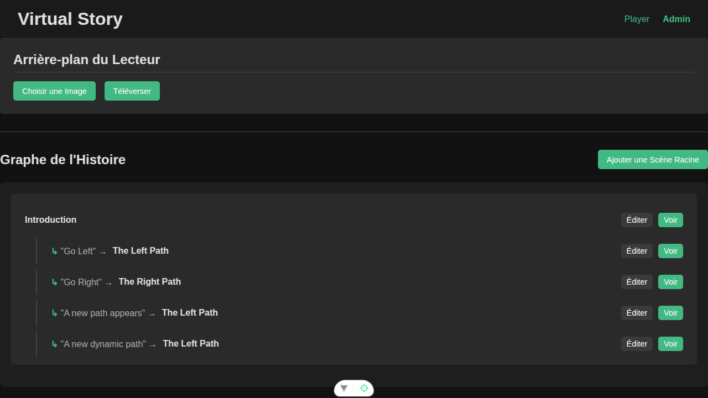

# Virtual Story

Application de bureau (Ubuntu) pour une expérience vidéo interactive, avec deux modes :

- **Histoire interactive** : un récit « dont vous êtes le héros » fait de courts segments vidéo ; à la fin de chaque
  segment, l'utilisateur choisit la suite (arbre de décision, chapitres, boucle d'ambiance). Inspiré de LifeSelector.
- **Live (IA)** : une conversation dynamique avec un personnage IA que vous définissez. Elle tourne **en local** sur votre
  GPU NVIDIA : l'IA écoute (micro), répond à voix haute, et **choisit elle-même** les vidéos et photos de votre
  médiathèque pour illustrer l'échange. Les boutons de choix sont remplacés par du texte libre, de la voix, et des
  réponses rapides proposées par l'IA.

## Architecture

```
Electron (app Ubuntu)
 ├─ Express :3000        interface Vue, API de l'histoire, base JSON, uploads, connexion admin
 │    └─ proxy /api/live (REST + WebSocket) ──┐
 └─ live-engine :3001    moteur Rust (axum) ◄──┘
      ├─ llama-server  (IA texte, CUDA)          modèles .gguf téléchargés depuis Hugging Face
      ├─ whisper-server (micro → texte, CUDA)
      └─ tts-server    (voix de l'IA, Chatterbox)  voix clonée depuis un échantillon
```

| Couche | Technologie |
|---|---|
| Interface | Vue 3 + Vite |
| Serveur web | Node.js + Express (sessions, uploads, ffmpeg via `ffmpeg-static`) |
| Données | fichier JSON (`db.json`, alasql) — pas de serveur de base de données |
| Moteur IA | Rust (axum, tokio, SQLite pour la médiathèque live) |
| Inférence | llama.cpp (LLM), whisper.cpp (reconnaissance vocale), Chatterbox (voix) |
| Paquet | Electron + electron-builder (AppImage, .deb) |

## Installer l'application (Ubuntu + NVIDIA)

Prérequis : Ubuntu 24.04 (22.04 : voir `LLAMA_MODE=source`), pilote NVIDIA, CUDA Toolkit (`nvcc`, pour `whisper-server`),
`build-essential cmake git curl`, Node ≥ 20.19, Rust (`cargo`).

```bash
git clone <url-du-depot> virtual-story && cd virtual-story
npm run dist:linux       # UI + moteur Rust + llama-server/whisper-server + AppImage + .deb dans ./dist
```

Au premier lancement : **Admin → Modèles IA** pour télécharger et charger l'IA, le micro et la voix (voir plus bas).
Détails de la compilation (architectures CUDA, versions, Ubuntu 22.04…) : [`live-engine/README.md`](live-engine/README.md).

Emplacements (app empaquetée) : base et médias dans `~/.config/Virtual Story`, modèles dans
`~/.local/share/virtual-story/models` (`VS_MODELS_DIR` pour changer), journaux dans `~/.config/Virtual Story/logs/`.

## Développement

Prérequis : Node ≥ 20.19, Rust, `npm` ou `pnpm`.

```bash
cd backend  && npm install        # serveur Express
cd ../frontend && npm install     # interface Vue
cd ../live-engine && cargo build  # moteur IA (optionnel si vous ne testez que le mode histoire)
cd .. && node backend/init-db.js  # première fois : crée la base JSON et l'utilisateur admin
./run                             # Express :3000 + Vite :5173 + moteur live :3001
```

- Interface de développement : <http://localhost:5173> (Vite proxifie `/api` vers Express et `/api/live` vers le moteur).
- Variables utiles (à **exporter dans le shell**, le fichier `.env` n'est pas lu) : `SESSION_SECRET` (obligatoire en
  production), `PORT`, `HOST`, `VS_DATA_DIR` (dossier de la base et des uploads).
- Mode histoire seul : `node backend/server.js` suffit (l'onglet Live affichera « moteur injoignable »).
- Tests du moteur : `cd live-engine && cargo test`.

## Mode Live (IA)

1. **Admin → Modèles IA** (`/admin/live/models`) : téléchargez (reprise après coupure, vérification SHA-256) puis
   chargez un modèle de texte, un modèle de reconnaissance vocale et le moteur de voix. Vous y voyez l'état, le plan
   mémoire (couches sur GPU, contexte), la VRAM utilisée et les journaux. Les derniers modèles choisis se rechargent
   au démarrage.
2. **Admin → Médiathèque** (`/admin/live/media`) : « Scanner les uploads » référence vos vidéos **et** photos ;
   annotez-les (tags, ambiance, intensité 1-5, boucle d'ambiance). L'IA ne voit que ces annotations.
3. **Admin → Personnages** (`/admin/live/personas`) : nom, âge (adulte), personnalité, style d'expression, scénario,
   premier message, voix de référence et réglages d'expressivité.
4. **Live** (`/live`) : choisissez un personnage, parlez ou écrivez. Parler pendant que l'IA répond la coupe.
   Le curseur d'intensité plafonne les médias proposés.

L'IA pilote l'écran avec des directives invisibles dans sa réponse (`[[show: …]]`, `[[ambient: …]]`,
`[[replies: …]]`, `[[state: …]]`) ; voir [`live-engine/README.md`](live-engine/README.md).

Règles : usage personnel, sans filtrage de thème ni avertissement ; une seule limite est conservée, **tous les personnages
sont des adultes** (une fiche avec un âge < 18 est refusée). Le moteur n'écoute que sur `127.0.0.1`, refuse les
WebSocket venant d'autres sites, et toute modification via `/api/live` exige la connexion admin.

## Mode histoire : tutoriel d'administration

L'administration est protégée par une connexion ; elle permet de construire et visualiser le récit.

### Sécurité et connexion

- **Identifiants initiaux** : après `node backend/init-db.js`, l'utilisateur est `admin` / `admin` — **changez-le**.
- **Connexion** : le lien **Admin** de l'en-tête ouvre une fenêtre de connexion si vous n'êtes pas connecté.
- **Mot de passe / utilisateurs** : section **Admin → Users & Profile** (changer son mot de passe, créer ou supprimer
  des administrateurs, sauf soi-même).
- **Session** : cookie de session ; protection contre la force brute (10 tentatives de connexion par 15 minutes).

### Graphe de l'histoire

La page d'administration principale affiche l'arbre des scènes : les scènes racines en haut, les scènes liées par un
choix imbriquées sous leur parent, un badge indique le chapitre. Chaque scène a des boutons **Edit** et **View**.



### Scènes

1. **Add Root Scene** crée un point de départ.
2. Après l'enregistrement, vous restez sur le formulaire pour enchaîner plusieurs scènes.
3. Sur la page d'édition : titre, chapitre, vidéo et miniature, **ajout d'un choix** (enfant) et **lien vers un parent**.

### Chapitres (« parts »)

Titre et scène de départ, renommables à tout moment. Une **vidéo d'ambiance en boucle** par chapitre s'affiche en fond
du lecteur (panneau de gauche). Les chapitres apparaissent dans l'en-tête pour un accès rapide.

### Lecteur

- Mode plein écran par défaut (la vidéo masque l'interface) ; lecture automatique avec son, repli en muet si le
  navigateur la bloque.
- « Previous Scenes » remonte dans le fil de l'histoire plutôt que dans l'historique du navigateur.
- **Player Background** (Admin) : image de fond globale derrière le lecteur.

## Auteur

- **Martial Limousin** — martial.limousin@gmail.com
